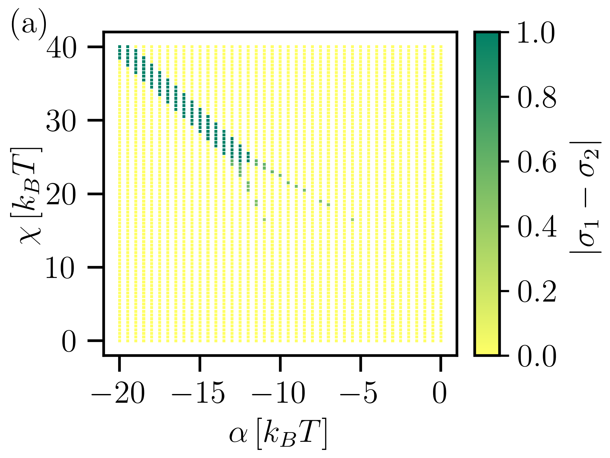
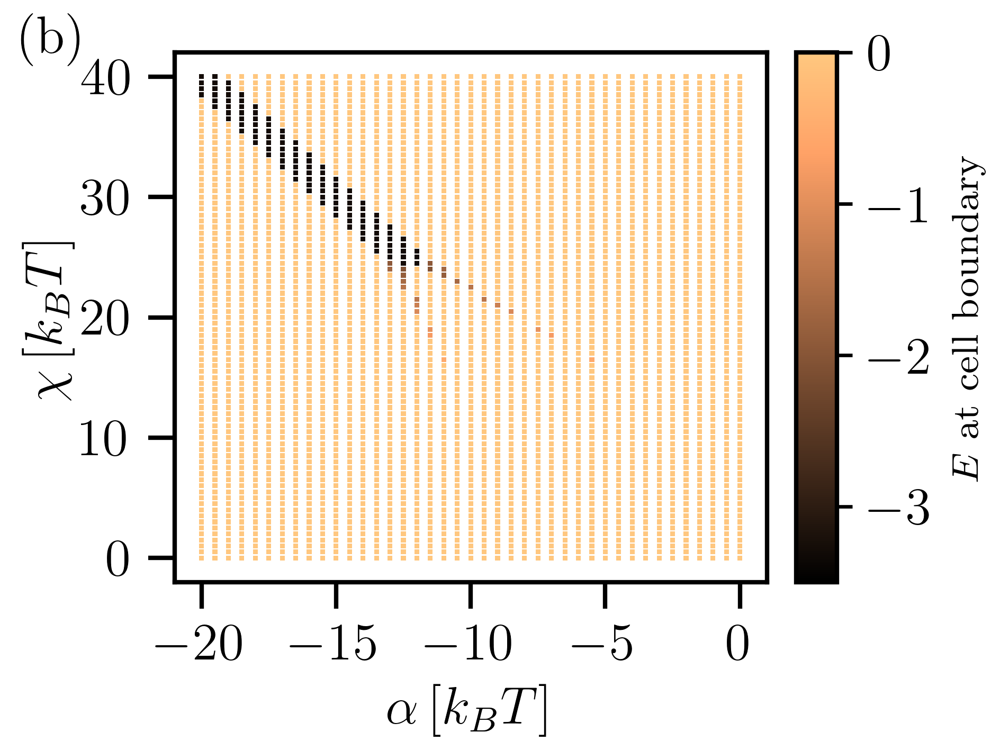

**The problem:**

Charge-regulation refers to the variable nature of surface charges of any colloidal object in response to its ambient conditions (e.g., solution pH, salt concentration, or presence of another charged object). For example, for given pH and salt concentrations, two adjacent spheres can have different charge densities based on their separation distance. This becomes particularly important for dense colloidal suspension where the particles can come close to each other. We developed a binary cell model where each sphere is surrounded by a spherical cell of variable thickness and the electric field at the boundary of this wrapping cell determines whether two adjacent cells are likely charged or differently charged. Clearly, a zero electric field at the boundary corresponds to a symmetric situation implying equally charged spheres whereas a non-zero electric field implies unequally charged spheres.

The electrostatic interaction between the spheres is described using nonlinear Poisson-Boltzmann theory and the chemical processes driving the surface charge regulation are described via two interaction parameters: (i) proton-surface interaction described by $\alpha$, and (ii) proton-proton interaction at a surface described by $\chi$.

For further details of the theory, please check our published paper: [Phys. Rev. Research **2**, 043417 (2020)](https://doi.org/10.1103/PhysRevResearch.2.043417)

**What does the code do:**

By minimizing the relevant free energy functional, this code determines the surface charge densities and the associated electrostatic interaction of two such neighboring spheres for given values of $\alpha$, $\chi$, and the cell radius $R_c$. It uses a combination of **finite element** and **gradient descent** methods and is written in **C++**. The code also uses **OpenMP** to perform part of the computation in parallel.

**Sample parameters and output:**

After compiling (e.g., using the command: g++ -fopenmp cell.cpp -o cell.out), the code can be run with the parameters in the runscript.txt file. Expected output files ('data.txt') are also provided. Two important parameters for this model are $\alpha$ and $\chi$. One can obtain phase diagrams like the ones shown below by varying these parameters. The left panel [panel (a)] shows that the charge densities $\sigma_{1,2}$ (scaled such that on each sphere it varies within the interval $-0.5$ and $0.5$) of the two spheres are not equal for certain values of alpha and chi parameters. For equally charged spheres, the quantity $|\sigma_1 - \sigma_2|$ is zero. The right panel [panel (b)] shows the  magnitude of the corresponding electric field $E$ at the cell boundary. Clearly, $E$ is zero for a symmetric situation ($\sigma_1 = \sigma_2$) and nonzero for an asymmetric situation ($\sigma_1 \neq \sigma_2$).

 &ensp;&ensp; 
